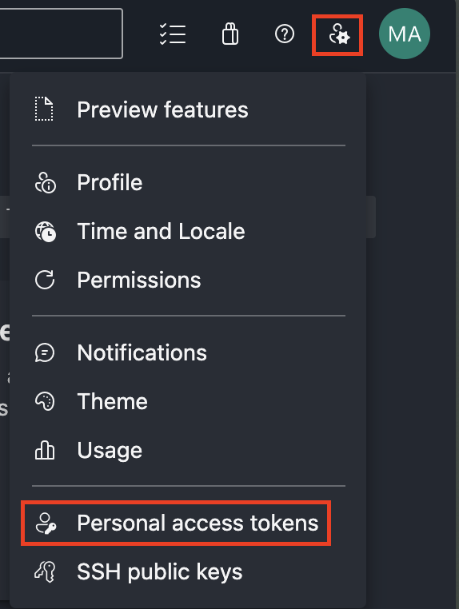
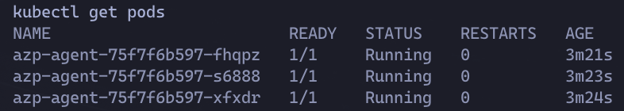
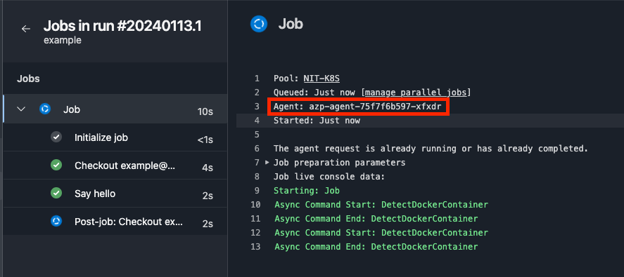
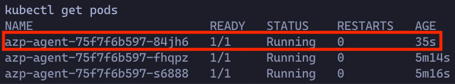
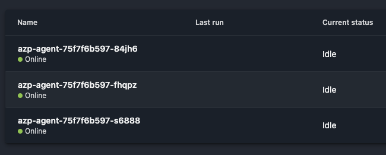

## Table of Contents

* [Introduction](#introduction)
* [The Problem](#the-problem)
* [Kubernetes and Containers to the Rescue](#kubernetes-and-containers-to-the-rescue)
* [Building a Custom Agent Image](#building-a-custom-agent-image)
* [Preparing Kubernetes for Deployment](#preparing-kubernetes-for-deployment)
* [Deploy to K8s](#deploy-to-k8s)
* [Refresh CronJob](#refresh-cronjob)
* [Putting it all together](#putting-it-all-together)
* [Conclusion](#conclusion)

## Introduction

At my current job, we use Azure DevOps and Azure Pipelines for code repos and CI/CD. For the vast majority of our pipelines, we use Microsoft's hosted agents. They're easy to use, always up-to-date and patched by Microsoft, and provide a clean and ephemeral environment for each job.

For example we simply declare the use of a [valid](https://learn.microsoft.com/en-us/azure/devops/pipelines/agents/hosted?view=azure-devops&tabs=yaml) `vmImage` within the pool stanza of our job definition, which will automatically run the job on a Microsoft-hosted agent running that OS:

```yaml
# azure-pipelines.yaml
jobs:
- job: myJob
  pool:
    vmImage: 'ubuntu-latest'
  steps:
  - bash: echo "Hello world"
```

## The Problem

Sometimes though, jobs need to run in our private network. Whether because they're doing code deployment, or in the case of my team, running a [HashiCorp Packer](https://www.packer.io/) build job which requires access to our vSphere infrastructure. Whatever the reason, Microsoft also provides a solution for this with [self-hosted agents](https://learn.microsoft.com/en-us/azure/devops/pipelines/agents/agents?view=azure-devops&tabs=yaml,browser#self-hosted-agents).

The downside with self-hosted agents, apart from managing the infrastructure ourselves, is that they don't traditionally have the benefits of cloud-agents that I mentioned earlier. Namely they don't stay up to date on OS and agent software patches automatically, and they don't provide ephemeral environments from one build to the next. They're also hard to scale, and not highly-available.

## Kubernetes and Containers to the Rescue

Thankfully we have containerization which will fill our desire to have a clean and predictable environment for each build, and Kubernetes to orchestrate, perform updates, and provide high-availability.

So here's the plan:

* Build a container image that runs the Azure Pipelines Agent
  * The container will startup and download the latest version of the Azure Pipelines agent to the container.
  * It will connect to our Azure DevOps (ADO) tenant and register itself in a chosen pool
  * It will wait for a new job to be assigned, and when it receives one will execute it.
  * Once the job is complete, it will gracefully de-register itself from ADO and then delete iteself from Kubernetes (if running in K8s, otherwise it will just exit).
* Deploy container image as a `Deployment` to K8s with multiple replicas.
* Deploy a `CronJob` to K8s which will periodically refresh the deployment to ensure its running the latest and greatest software.

## Building a Custom Agent Image

First we need to build a container image which will run our agent. The easiest way is with Docker. Microsoft actually already gets us half way there [with a basic tutorial](https://learn.microsoft.com/en-us/azure/devops/pipelines/agents/docker?view=azure-devops#linux), however we'll make some modifications to suit our requirements.

1. First we create a file called `start.sh` which will be used as our entrypoint when the container starts up. We're using Microsoft's script as a starting point, with the highlighted portions indicating my additions and changes. This script downloads the agent software, registers itself with our tenant, and waits to receive a job.

    ```bash {linenos=false,hl_lines=["40-44",82,103]}
    #!/bin/bash
    set -e

    if [ -z "${AZP_URL}" ]; then
      echo 1>&2 "error: missing AZP_URL environment variable"
      exit 1
    fi

    if [ -z "${AZP_TOKEN_FILE}" ]; then
      if [ -z "${AZP_TOKEN}" ]; then
        echo 1>&2 "error: missing AZP_TOKEN environment variable"
        exit 1
      fi

      AZP_TOKEN_FILE="/azp/.token"
      echo -n "${AZP_TOKEN}" >"${AZP_TOKEN_FILE}"
    fi

    unset AZP_TOKEN

    if [ -n "${AZP_WORK}" ]; then
      mkdir -p "${AZP_WORK}"
    fi

    cleanup() {
      trap "" EXIT

      if [ -e ./config.sh ]; then
        print_header "Cleanup. Removing Azure Pipelines agent..."

        # If the agent has some running jobs, the configuration removal process will fail.
        # So, give it some time to finish the job.
        while true; do
          ./config.sh remove --unattended --auth "PAT" --token $(cat "${AZP_TOKEN_FILE}") && break

          echo "Retrying in 30 seconds..."
          sleep 30
        done

        # Once config.sh remove is successful, delete this pod
        if [ -n "$POD_NAME" ]; then
          print_header "Deleting this pod..."
          kubectl delete pod $POD_NAME
        fi
      fi
    }

    print_header() {
      lightcyan="\033[1;36m"
      nocolor="\033[0m"
      echo -e "\n${lightcyan}$1${nocolor}\n"
    }

    # Let the agent ignore the token env variables
    export VSO_AGENT_IGNORE="AZP_TOKEN,AZP_TOKEN_FILE"

    print_header "1. Determining matching Azure Pipelines agent..."

    AZP_AGENT_PACKAGES=$(curl -LsS \
      -u user:$(cat "${AZP_TOKEN_FILE}") \
      -H "Accept:application/json;" \
      "${AZP_URL}/_apis/distributedtask/packages/agent?platform=${TARGETARCH}&top=1")

    AZP_AGENT_PACKAGE_LATEST_URL=$(echo "${AZP_AGENT_PACKAGES}" | jq -r ".value[0].downloadUrl")

    if [ -z "${AZP_AGENT_PACKAGE_LATEST_URL}" -o "${AZP_AGENT_PACKAGE_LATEST_URL}" == "null" ]; then
      echo 1>&2 "error: could not determine a matching Azure Pipelines agent"
      echo 1>&2 "check that account "${AZP_URL}" is correct and the token is valid for that account"
      exit 1
    fi

    print_header "2. Downloading and extracting Azure Pipelines agent..."

    curl -LsS "${AZP_AGENT_PACKAGE_LATEST_URL}" | tar -xz &
    wait $!

    source ./env.sh

    trap "cleanup; exit 0" EXIT
    trap "cleanup; exit 130" INT
    trap "cleanup; exit 143" TERM
    trap "cleanup; exit 143" SIGTERM

    print_header "3. Configuring Azure Pipelines agent..."

    ./config.sh --unattended \
      --agent "${AZP_AGENT_NAME:-$(hostname)}" \
      --url "${AZP_URL}" \
      --auth "PAT" \
      --token $(cat "${AZP_TOKEN_FILE}") \
      --pool "${AZP_POOL:-Default}" \
      --work "${AZP_WORK:-_work}" \
      --replace \
      --acceptTeeEula &
    wait $!

    print_header "4. Running Azure Pipelines agent..."

    chmod +x ./run.sh

    # To be aware of TERM and INT signals call ./run.sh
    # Running it with the --once flag at the end will shut down the agent after the build is executed
    ./run.sh "$@ --once" &
    wait $!
    ```

    Notably we've made the following changes:
    * Added an additional step to our `cleanup()` function that is called on shutdown. This extra steps checks for the existence of the `POD_NAME` environment variable. This is a variable we will pass to the container when running in K8s. If this is detected, it will delete itself from Kubernetes. K8s will detect the number of replicas is not matching the desired amount, and spin up a new one in its place automatically.
    * Added an additional trap for the `SIGTERM` signal to run the `cleanup()` function mentioned above.
    * Call the `run.sh` script with the `--once` flag so the agent shuts down when it completes a job.

1. Next we create a `Dockerfile` which defines how our container image is built:

    ```dockerfile
    # dockerfile
    FROM ubuntu:22.04

    RUN apt update
    RUN apt upgrade -y
    RUN apt install -y curl wget git jq libicu70

    # Install Kubectl
    RUN curl -LO "https://dl.k8s.io/release/$(curl -L -s https://dl.k8s.io/release/stable.txt)/bin/linux/amd64/kubectl"
    RUN install -o root -g root -m 0755 kubectl /usr/local/bin/kubectl

    # Also can be "linux-arm", "linux-arm64".
    ENV TARGETARCH="linux-x64"

    WORKDIR /azp/

    COPY ./start.sh ./
    RUN chmod +x ./start.sh

    RUN useradd -m agent
    RUN chown agent ./
    USER agent

    ENTRYPOINT ./start.sh
    ```

    This `Dockerfile` does the following:
    1. Starts from an Ubuntu 22.04 base (but notably not a specific patch version or SHA hash so each time this image is built it will get the latest updates for Ubuntu from the Docker Hub)
    1. Installs Kubectl CLI utility to run commands against the K8s cluster this container will be running in.
    1. Sets a required environment variable which the agent software will look for at runtime.
    1. Declares a working directory of `/azp` and copies our `start.sh` file to it.
    1. Creates a new user called `agent` with a home directory, and switches execution to that new user.
    1. Sets the `start.sh` as the entrypoint for when the container starts.

1. Build the image and push it to a container registry of your choice. You can do this step by hand on your own machine, or as part of an Azure Pipeline, GitHub Action, etc.

    I recommend tagging with the `latest` tag which will come in handy when we deploy to K8s with an `ImagePullPolicy` of `Always`.

    I also recommend running the build and push on a schedule to ensure it's being kept up to date with upstream Ubuntu and dependency updates.

## Preparing Kubernetes for Deployment

Next we prepare our Kubernetes environment to run our custom agent container.

1. First we need to generate an Azure DevOps personal access token (PAT) so that our agents can authenticate to ADO. This can be done by clicking the user settings button, and choosing "Personal access tokens":

    

    Give the token at minimum the "Read & manage" permission on "Agent Pools".

    
**Warning!** Take caution with what permissions you give this PAT. All jobs that run on this agent will be able to read this token, so you shouldn't give it any additional access than what is required.

Each job that runs gets a separate [job access token](https://learn.microsoft.com/en-us/azure/devops/pipelines/process/access-tokens?view=azure-devops&tabs=yaml) which is used to clone repos, add git tags, upload artifacts, etc. The token we've generated here is stricly for the agent to register itself and pick up new jobs.


1. Create a namespace to deploy our Kubernetes resources to:

    ```yaml
    # namespace.yaml
    apiVersion: v1
    kind: Namespace
    metadata:
      name: azp-agent
    ```

1. Base64 encode your PAT:

    ```shell
    > echo -n "TOKEN" | base64
    VE9LRU4=
    ```

1. Place the base64 encoded PAT into a secret object and apply it to your cluster:

    ```yaml
    # secret.yaml
    apiVersion: v1
    kind: Secret
    metadata:
      name: azp-token
      namespace: azp-agent
    data:
      token: VE9LRU4=
    ```

1. Next we need to create some RBAC objects to allow our agents to delete themselves from the cluster once they've completed a job. We also need to allow our CronJob to restart the deployment which causes a new rollout.

    First is a `ServiceAccount`:

    ```yaml
    # service-accounts.yaml
    apiVersion: v1
    kind: ServiceAccount
    metadata:
      name: azp-agent-maint-sa
      namespace: azp-agent
    ```

    Next is a `Role` that allows deleting pods and re-rolling deployments in the `azp-agent` namespace:

    ```yaml
    # role.yaml
    apiVersion: rbac.authorization.k8s.io/v1
    kind: Role
    metadata:
      name: azp-agent-maint-role
      namespace: azp-agent
    rules:
      - apiGroups: [""]
        resources: ["pods"]
        verbs: ["delete"]
      - apiGroups: ["apps"]
        resources: ["deployments"]
        verbs: ["get", "patch"]
    ```

    
**Warning!** Take caution with what permissions you give this roll. All jobs that run on this agent will inherit these permissions within the Kubernetes cluster. The permissions here are the bare-minimum required.

Also a reminder that a `Role` only applies to the namespace that it was created in. This is as opposed to a `ClusterRole` which applies cluster-wide.


    Finally a `RoleBinding` that binds the `ServiceAccount` to the `Role`:

    ```yaml
    # role-binding.yaml
    apiVersion: rbac.authorization.k8s.io/v1
    kind: RoleBinding
    metadata:
      name: azp-agent-maint-rolebinding
      namespace: azp-agent
    subjects:
      - kind: ServiceAccount
        name: azp-agent-maint-sa
        namespace: azp-agent
    roleRef:
      kind: Role
      name: azp-agent-maint-role
      apiGroup: rbac.authorization.k8s.io
    ```

## Deploy to K8s

Now we can deploy the agent(s) to our Kubernetes cluster. We'll use a `Deployment` object and set a number of replicas to suit our workload size. 3 is a good starting point.

A deployment is nice because if a pod is deleted (like when a pipeline job finishes), K8s will spin up a replacement pod automatically in its place.

```yaml
apiVersion: apps/v1
kind: Deployment
metadata:
  name: azp-agent
  namespace: azp-agent
spec:
  replicas: 3
  selector:
    matchLabels:
      app: azp-agent
  template:
    metadata:
      labels:
        app: azp-agent
    spec:
      serviceAccountName: azp-agent-maint-sa
      containers:
        - name: azp-agent
          image: <Custom Image Name>
          imagePullPolicy: Always
          env:
            - name: AZP_URL
              value: https://dev.azure.com/<Org-Name>
            - name: AZP_TOKEN
              valueFrom:
                secretKeyRef:
                  name: azp-token
                  key: token
            - name: AZP_AGENT_NAME
              valueFrom:
                fieldRef:
                  fieldPath: metadata.name
            - name: AZP_POOL
              value: <Azure Pipelines Pool Name>
            - name: POD_NAME
              valueFrom:
                fieldRef:
                  fieldPath: metadata.name
          lifecycle:
            preStop:
              exec:
                command:
                  [
                    "/bin/bash",
                    "-c",
                    "/azp/config.sh remove --unattended --auth PAT --token $(cat /azp/.token)",
                  ]
```

This deployment does the following:

* Deploys 3 pods running our container image
* Sets the `ImagePullPolicy` to `Always`, ensuring the latest image is downloaded for each new pod. This pairs nicely using a `latest` tag when building and specifying your image.
* Sets the required environment variables:
  * `AZP_URL`: The URL to your Azure DevOps Organization
  * `AZP_TOKEN`: The PAT we generated earlier. Here we reference the secret object we created.
  * `AZP_AGENT_NAME`: The name of the agent which will appear in Azure DevOps and at the top of each job's log file. We use the pod's name as the agent name, and we do so by using the [downward API](https://kubernetes.io/docs/concepts/workloads/pods/downward-api/).
  * `AZP_POOL`: The name of a pre-existing pool in Azure DevOps to which new agents should be added to. You can use the default pool or a new one just for these agents.
  * `POD_NAME`: Same as `AZP_AGENT_NAME` we pass in the pod's name.
* Uses our `azp-agent-maint-sa` `ServiceAccount` which gives the pod access to delete itself.
* Sets a `preStop` lifecycle hook which will call the de-registration function automatically when a pod is terminated. This is for when we remove an agent that hasn't had a chance to run a job yet. In theory the additional `trap` function we added for `SIGTERM` signals should perform this cleanup, but this adds a second line of defence to ensure we don't have any stale agents left in our pool that no longer exist in our cluster.

## Refresh CronJob

At this point you could stop here and have a fully working solution. But I aim to take it a step further to ensure our pods are kept fresh in the event we don't have a job for a few days or weeks.

We can create a simple `CronJob` that performs a rollout restart on our deployment every week (for example). This will delete each pod replica, and deploy a new one in its place. This allows you to pull a new copy of the image, as well as any updates to the Azure Pipelines agent itself.

```yaml
apiVersion: batch/v1
kind: CronJob
metadata:
  name: restart-deployment-job
  namespace: azp-agent
spec:
  schedule: "0 0 * * 0" # Every Sunday at midnight
  jobTemplate:
    spec:
      template:
        spec:
          serviceAccountName: azp-agent-maint-sa
          containers:
            - name: kubectl-restart
              image: ubuntu:latest
              command: ["/bin/bash"]
              args:
                - -c
                - |
                  apt-get update &&
                  apt-get install -y curl &&
                  curl -LO "https://dl.k8s.io/release/$(curl -L -s https://dl.k8s.io/release/stable.txt)/bin/linux/amd64/kubectl" &&
                  chmod +x ./kubectl &&
                  mv ./kubectl /usr/local/bin/kubectl &&
                  kubectl rollout restart deployment/azp-agent
          restartPolicy: OnFailure
```

This `CronJob` does the following:

* Uses a Ubuntu image.
* Uses our `azp-agent-maint-sa` `ServiceAccount` which gives the job access to restart our deployment.
* Updates apt, installs curl and kubectl.
* Runs `kubectl rollout restart` against our deployment.

## Putting it all together

Let's test this out!

Here, we see our three agents running in Kubernetes:


We'll create a basic Azure Pipeline and use the pool that we specified in the `AZP_POOL` environment variable to ensure it targets our K8s agents.

```yaml
# azure-pipelines.yaml
trigger:
- main

pool:
  name: <POOL NAME>

steps:
- script: echo Hello, world!
  displayName: 'Say Hello'
```

Based on our job log, we can see agent `azp-agent-75f7f6b597-xfxdr` picked up the job and ran it successfully.


Now back in K8s, that agent is gone, and a new one has been created to replace it automatically (notice the difference in pod age).


And if we check in Azure DevOps, the agent that ran our job (`azp-agent-75f7f6b597-xfxdr`) has been cleanly removed from the pool, with the new one already registered and ready to accept new jobs.


## Conclusion

There you have it! We can run jobs in our own private network, while maintaining the always up-to-date, ephemeral, and highly-available nature of cloud-agents that we've come to expect.

Hopefully you found this helpful. If you have any questions or suggestions, [shoot me an email](mailto:max.a.anderson95@gmail.com)!
