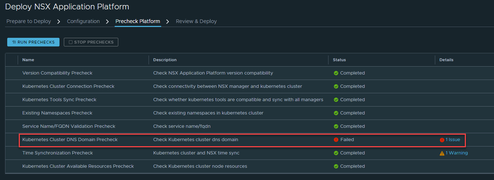
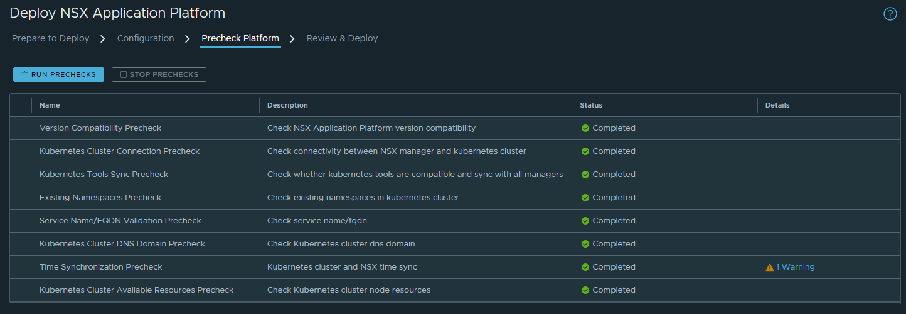

## The Problem

During my quest to roll out the new NSX Application Platform in our production environment, I came across a very odd issue when running through the installation wizard to install NAPP on an RKE2 Kubernetes cluster.

During the **Precheck Platform** step of the wizard, the **Kubernetes Cluster DNS Domain Precheck** step reported as failed. When viewing the details, it simply says to contact your administrator, and the [VMware docs](https://docs.vmware.com/en/VMware-NSX/4.0/nsx-application-platform/GUID-BF5917B3-F873-4D8F-BF04-1F7CC5241EE5.html) that have a page for what to do on pre-check failures was conveniently missing a section for this specific check. How helpful... 



If you just want to skip to the solution [scroll down to the TL;DR](#tldr).

## Investigation

Off to the logs! I started by downloading a support bundle from the manager cluster. After extracting the logs, I opened the `/var/log/proton/napps.log` file for the active manager node. I got lucky on the first try unziping the logs for the active node, but you may need to search through each node's logs.

Within the log I can see the system is running a function to extract the cluster dns domain. This seems like what we're looking for!

```
2022-11-17 22:41:32,901 INFO nsx_kubernetes_lib.vmware.kubernetes.service.kubectl.kubectl_117_service[289]:get_cluster_dns_domain Getting cluster dns domain {}
```

However a few lines later we see that it fails, reporting that the confimap it was looking for in our cluster doesn't exist.

```
2022-11-17 22:41:32,981 ERROR nsx_kubernetes_lib.vmware.kubernetes.common.utility[35]:execute Error executing command ['kubectl', 'get', 'configmap', 'kubeadm-config', '-n', 'kube-system', '-o', 'yaml', '--kubeconfig=/config/vmware/napps/.kube/config'],  'Error from server (NotFound): configmaps "kubeadm-config" not found\n'
2022-11-17 22:41:32,981 ERROR __main__[70]:main Error executing function get_cluster_dns_domain. Error message: Error from server (NotFound): configmaps "kubeadm-config" not found\n
```

I notice that it's looking for a ConfigMap called **kubeadm-config**. Just to ensure that this wasn't some bug I ran the same command myself and sure enough it returned no results.

```
> kubectl get configmap -n kube-system kubeadm-config

Error from server (NotFound): configmaps "kubeadm-config" not found
```

It turns out that RKE2 does not use Kubeadm to form the cluster and thus never writes this ConfigMap to the cluster state like other K8s distributions do. The NAPP wizard just assumes this file will always exist and uses it to extract the cluster's DNS domain name during setup.

## The fix

So how do we fix this without switching to another K8s distribution? If we look at a **kubeadm-config** ConfigMap from another cluster (I used a [Kind](https://kind.sigs.k8s.io/) cluster), we find that the **dnsDomain** is indeed listed.

```txt {linenos=false,hl_lines=[1,"28-29"]}
> kubectl get configmap -n kube-system kubeadm-config -o yaml

apiVersion: v1
data:
  ClusterConfiguration: |
    apiServer:
      certSANs:
      - localhost
      - 127.0.0.1
      extraArgs:
        authorization-mode: Node,RBAC
        runtime-config: ""
      timeoutForControlPlane: 4m0s
    apiVersion: kubeadm.k8s.io/v1beta3
    certificatesDir: /etc/kubernetes/pki
    clusterName: kind
    controlPlaneEndpoint: kind-control-plane:6443
    controllerManager:
      extraArgs:
        enable-hostpath-provisioner: "true"
    dns: {}
    etcd:
      local:
        dataDir: /var/lib/etcd
    imageRepository: registry.k8s.io
    kind: ClusterConfiguration
    kubernetesVersion: v1.25.3
    networking:
      dnsDomain: cluster.local
      podSubnet: 10.244.0.0/16
      serviceSubnet: 10.96.0.0/16
    scheduler: {}
kind: ConfigMap
metadata:
  creationTimestamp: "2022-11-20T19:44:33Z"
  name: kubeadm-config
  namespace: kube-system
  resourceVersion: "198"
  uid: 5a087414-6ef3-4e44-b146-08ff39ceb6d6
```

To fix we simply create our own **kubeadm-config** ConfigMap with just the data we need:
```txt {linenos=false,hl_lines=["4-5"]}
apiVersion: v1
data:
  ClusterConfiguration: |
    networking:
      dnsDomain: cluster.local
kind: ConfigMap
metadata:
  name: kubeadm-config
  namespace: kube-system
  annotations:
    a8r.io/description: "This is a fake configmap that has to be in place for NAPP to be able to pull the dnsDomain field."
```

By default most clusters use **cluster.local** as the DNS domain name. This is the case for RKE2. I also added an annotation that describes why we made this object in the first place.

Then we just throw this in a file and apply it to our cluster!

```
> kubectl apply -f fake-kubeadm-config.yaml

configmap/kubeadm-config created
```

If we run the prechecks again, voila, the DNS domain name check is now passing!


## TL;DR
Apply the following configmap to your cluster and re-run the wizard:

```txt
apiVersion: v1
data:
  ClusterConfiguration: |
    networking:
      dnsDomain: cluster.local
kind: ConfigMap
metadata:
  name: kubeadm-config
  namespace: kube-system
  annotations:
    a8r.io/description: "This is a fake configmap that has to be in place for NAPP to be able to pull the dnsDomain field."
```