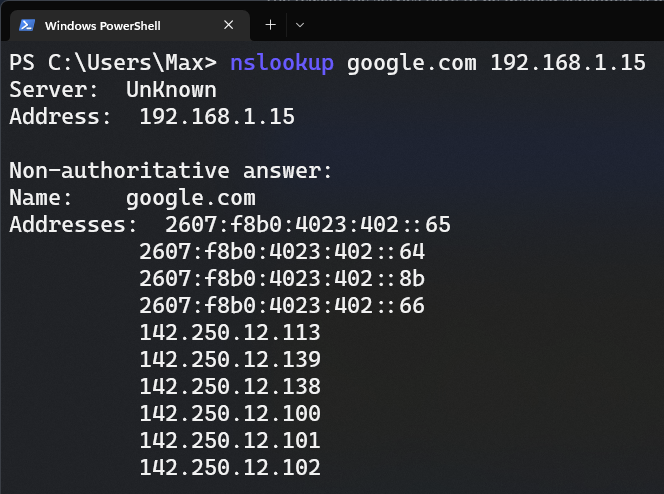
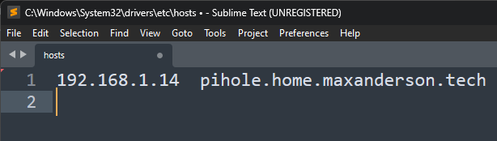
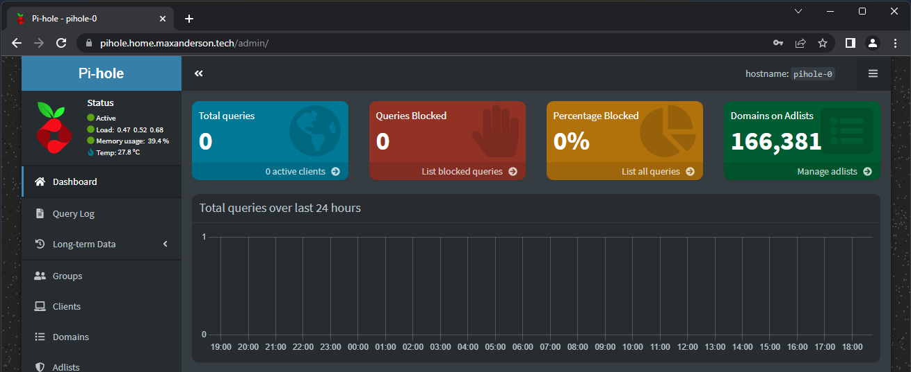

## Introduction

In my home lab I run a three node Kubernetes cluster using the [RKE2 distribution](https://docs.rke2.io/) from Rancher Labs. I use this for testing/experimentation, running my Unifi wifi-controller, and most importantly a network-wide ad-blocking service called [Pi-hole](https://pi-hole.net/).

Pi-hole is a DNS service that can be deployed to your network to block ads and malicous websites. It comes with a default block list, but can be easily extended with additional block lists from the cocmmunity. Once your network clients have been configured to use Pi-hole as their DNS resolver (either statically or via DHCP options), Pi-hole will analyze each request and if a requested domain is on the block list, Pi-hole will return an NXDOMAIN response to the client, preventing them from connecting to that site.

Pi-hole can be deployed as an OS package to most major linux distributions, as well as run inside a container on Docker or Kubernetes. It provides a easy-to-use web interface for configuration as well as handy graphs and metrics to help you understand what types of requests are being made, and which ones are being blocked.

## The Problem

One major downside of Pi-hole is that it doesn't natively support high-availability. I wanted the ability to take down a node in my K8s cluster for maintenance without DNS services (and effectivly internet services as a whole) going down.

Community projects such as [Gravity-Sync](https://github.com/vmstan/gravity-sync) have been created in an attempt to fix this. It works by periodically copying the pihole database from one instance to the other. However there are some issues with the way it works that don't fit my needs. For one, it requires SSH between nodes, and doesn't appear to have an easy way to integrate into a containerized environment. Finally it only supports a maximum of two nodes.

### Introducing Orbital-Sync

[Orbital-Sync](https://github.com/mattwebbio/orbital-sync) is another community package that takes a different approach. It's a process that runs separate from your pi-hole instances, and connects to each instance remotely over HTTP (no SSH required 😅). It uses Pi-hole's native backup feature to take a backup of the "primary" instance, then immediately restores that backup on any number of secondary instances. It doesn't require modification to the pi-hole image, doesn't require SSH, and allows me to scale instances to more than two. Perfect!

## Installation

If you just want a TL;DR on how to install this, go over to the [GitHub repo](https://github.com/MaxAnderson95/pi-hole-ha-on-k8s) where I host these manifests. 

### Prerequisites

This guide assumes you have a Kubernetes cluster with the following:

* A way to expose Services of type LoadBalancer. In my cluster I utilize [MetalLB](https://metallb.universe.tf/).
* An ingress controller. I'm using [Traefik](https://doc.traefik.io/traefik/providers/kubernetes-ingress/) and subsequently will be using Traefik's custom IngressRoute CRD. But it can easily be adapted to use a standard Ingress definition.
* [CertManager](https://cert-manager.io/) to issue certificates for the web interface.
* A persistent volume storage system with auto-provisioning. I'm using [Longhorn](https://longhorn.io/)

### Namespace

To get started, we'll create a namespace to hold the objects we're about to create. 

```yaml
apiVersion: v1
kind: Namespace
metadata:
  name: pihole
```

### Pi-hole Confiration ConfigMap

Next we'll create a ConfigMap that holds any of the (non-secret) Pi-hole configurable options that we'd like to set for each of our instances. The comprehensive list of options can be found [here](https://github.com/pi-hole/docker-pi-hole#environment-variables). These options will later be passed in as environment variables to the Pi-hole pods.

```yaml
apiVersion: v1
kind: ConfigMap
metadata:
  name: pihole-configmap
  namespace: pihole
data:
  TZ: "America/New_York"
  PIHOLE_DNS_: "8.8.8.8;8.8.4.4"
```

### Pi-hole Admin Password Secret

Next we'll create a secret to store our Pi-hole administrator password. This is critical because this password will be used by Orbital-Sync to log into each node to perform backup and restore operations. We do this by creating a secret object with a `WEBPASSWORD` data field.

```yaml
apiVersion: v1
kind: Secret
metadata:
  name: pihole-password
  namespace: pihole
type: Opaque
data:
  WEBPASSWORD: QWJjMTIzISE= # Abc123!! Base64 encoded
```


**Note:** Make sure that the value for `WEBPASSWORD` is Base64 encoded.


### Creating a StatefulSet to run the Pods

Next we will deploy the actual Pi-hole pods to our cluster. The plan is to deploy 3 replicas for high-availability. We will do this using a StatefulSet. This gives us a number of benefits over a standard Deployment object:

* It ensures a stable and well-known network name for each pod within the cluster. This will be important later when we configure Orbital-Sync.
* It ensures our "primary" instance of Pi-hole starts first.
* It ensures that each of our Pi-hole instances have their own separate PersistentVolumes.

Within our StatefulSet definition we will do the following:

* Create three pod replicas each with a single container called `pihole` using the pihole Docker image.
* Mount in the [ConfigMap](#pi-hole-confiration-configmap) and [Secret](#pi-hole-admin-password-secret) as environment variables.
* Expose the HTTP, DNS-TCP, and DNS-UDP ports.
* Configure liveness and readiness probes.
* Create PersistentVolumeClaim templates for `/etc/pihole` and `/etc/dnsmasq.d`.
* Mount those PVC templates as volumes within the container to their respective paths.

Here is our completed StatefulSet definition:

```yaml
apiVersion: apps/v1
kind: StatefulSet
metadata:
  name: pihole
  namespace: pihole
spec:
  selector:
    matchLabels:
      app: pihole
  serviceName: pihole
  replicas: 3
  template:
    metadata:
      labels:
        app: pihole
    spec:
      containers:
        - name: pihole
          image: pihole/pihole:2022.12.1
          envFrom:
            - configMapRef:
                name: pihole-configmap
            - secretRef:
                name: pihole-password
          ports:
            - name: svc-80-tcp-web
              containerPort: 80
              protocol: TCP
            - name: svc-53-udp-dns
              containerPort: 53
              protocol: UDP
            - name: svc-53-tcp-dns
              containerPort: 53
              protocol: TCP
          livenessProbe:
            httpGet:
              port: svc-80-tcp-web
            initialDelaySeconds: 10
            periodSeconds: 5
          readinessProbe:
            httpGet:
              port: svc-80-tcp-web
            initialDelaySeconds: 10
            periodSeconds: 10
            failureThreshold: 10
          volumeMounts:
            - name: pihole-etc-pihole
              mountPath: /etc/pihole
            - name: pihole-etc-dnsmasq
              mountPath: /etc/dnsmasq.d
  volumeClaimTemplates:
    - metadata:
        name: pihole-etc-pihole
        namespace: pihole
      spec:
        accessModes:
          - "ReadWriteOnce"
        resources:
          requests:
            storage: 3Gi
    - metadata:
        name: pihole-etc-dnsmasq
        namespace: pihole
      spec:
        accessModes:
          - "ReadWriteOnce"
        resources:
          requests:
            storage: 3Gi
```

### Services

Next we need to expose the Web and DNS services, as well as create a "headless" service for our StatefulSet. Deploying a [headless service](https://kubernetes.io/docs/concepts/services-networking/service/#headless-services) is a common pattern when using StatefulSets.

We'll expose web within the cluster only, and later use an ingress controller to allow external traffic. As for DNS, we need to expose these directly as type `LoadBalancer` since non-HTTP traffic generally isn't supported through an ingress controller.

#### Headless Service

First let's start with the headless service:

```yaml
apiVersion: v1
kind: Service
metadata:
  name: pihole
  namespace: pihole
  labels:
    app: pihole
spec:
  clusterIP: None
  selector:
    app: pihole
```


**Note** the `clusterIP` of `None`. This is what designates it as a headless service. When performing a DNS lookup for `pihole`, the cluster DNS service will instead just return the IP addresses of all pods in the stateful set. This also gives us the ability to single out a specific pod by name by querying for `{Pod Name}.{StatefulSet Name}.{Namespace}.svc.cluster.local`. This will come in handy later.


#### Web Service

Next we expose the Web interface as a standard ClusterIP service, but importantly we only want to direct web interface traffic to our "primary" instance of Pi-hole. This is because changes made to any of the secondary instances will be overwritten automatically once we setup Orbital-Sync.

```yaml {linenos=false,hl_lines=[9]}
kind: Service 
apiVersion: v1 
metadata:
  name: pihole-web-svc
  namespace: pihole
spec:
  selector:
    app: pihole
    statefulset.kubernetes.io/pod-name: pihole-0
  type: ClusterIP
  ports:
    - name: svc-80-tcp-web
      port: 80
      targetPort: 80
      protocol: TCP
```

To do this we use an additonal selector to point to the specific `pihole-0` pod. This `statefulset.kubernetes.io/pod-name` label is applied to the pod automatically by the StatefulSet controller, so we use it to our advantage to single out the primary instance of Pi-hole.

#### DNS Service

Finally we expose the actual DNS services on TCP and UDP ports 53 as type `LoadBalancer`. This will provide us an IP address external to the cluster that we will point our network clients to for DNS resolution:

```yaml {linenos=false,hl_lines=[7,24]}
kind: Service
apiVersion: v1
metadata:
  name: pihole-dns-udp-svc
  namespace: pihole
  annotations:
    metallb.universe.tf/allow-shared-ip: "pihole"
spec:
  selector:
    app: pihole
  type: LoadBalancer
  ports:
    - name: svc-53-udp-dns
      port: 53
      targetPort: 53
      protocol: UDP
---
kind: Service
apiVersion: v1
metadata:
  name: pihole-dns-tcp-svc
  namespace: pihole
  annotations:
    metallb.universe.tf/allow-shared-ip: "pihole"
spec:
  selector:
    app: pihole
  type: LoadBalancer
  ports:
    - name: svc-53-tcp-dns
      port: 53
      targetPort: 53
      protocol: TCP
```

The reason the services need to be defined separately is because services of type `LoadBalancer` only expose the first port listed, with all others being truncated. This creates a new problem in that by default, they will get different external IP addresses. For MetalLB, we can solve this by setting an annotation on each service with the same "sharing key". This tells the MetalLB controller that these services can use the same external IP address.


**Note** DNS by default runs on UDP, but requires TCP for zone transfers and transmition of data larger than 512 bytes. It's best practice to expose both to your clients.


Once applied we can see this external IP sharing in action:

```text
> kubectl get svc -n pihole

NAME                 TYPE           CLUSTER-IP      EXTERNAL-IP    PORT(S)        AGE
pihole               ClusterIP      None            <none>         <none>         17h
pihole-dns-tcp-svc   LoadBalancer   10.43.114.157   192.168.1.15   53:32177/TCP   17h
pihole-dns-udp-svc   LoadBalancer   10.43.72.145    192.168.1.15   53:30524/UDP   17h
pihole-web-svc       ClusterIP      10.43.70.47     <none>         80/TCP         17h
```

Take note of the `External-IP` as you will need it later to point your clients to.

As a test, try sending a DNS request to the external IP from your local workstation. You should get a response:



### Ingress

In order to access the primary Pi-hole's web interface externally, we need to expose it with our ingress controller. Each type of ingress controller generally can be configured using the built-in `Ingress` object, but usually rely on a ton of annotations in order to provide custom configuration for the Ingress controller of your choice. As such, it's usually better to use your Ingress controller's own CRD (custom resource definition) to define ingress. For Traefik this is the `IngressRoute` object.

#### TLS Certificate

To secure our web-interface we'll want to first create a TLS certificate using [CertManager](https://cert-manager.io/). You'll need to first create a `ClusterIssuer` for the CA of your choice, I'll be using [Let's Encrypt](https://letsencrypt.org/). The details for how to do this can be found [here](https://cert-manager.io/docs/configuration/acme/).

Let's create our certificate:

```yaml
apiVersion: cert-manager.io/v1
kind: Certificate
metadata:
  name: pihole-cert
  namespace: pihole
spec:
  secretName: pihole-tls
  issuerRef:
    name: letsencrypt-prod
    kind: ClusterIssuer
  commonName: "pihole.home.maxanderson.tech"
  dnsNames:
    - "pihole.home.maxanderson.tech"
```

This will ask CertManager to request a certificate from Let's Encrypt, and then place it in the `pihole-tls` secret object.

After a few minutes the ready status should show `True`:

```text
> kubectl get certificate -n pihole

NAME          READY   SECRET       AGE
pihole-cert   True    pihole-tls   2m
```

#### IngressRoutes with Middleware
Next we create the ingress routes, with the proper re-directions needed. We achieve the following:

* We have one ingress route to handle HTTP traffic, and another to handle HTTPS traffic. These use the web and websecure `entryPoints` in Traefik respectively.
* When someone goes to http://pihole.home.maxanderson.tech, it will redirect to HTTPS
* When someone goes to https://pihole.home.maxanderson.tech/, it will redirect to /admin

Here's our manifests:

```yaml
apiVersion: traefik.containo.us/v1alpha1
kind: Middleware
metadata:
  name: redirecthttps
  namespace: pihole
spec:
  redirectScheme:
    scheme: https
    permanent: true
---
apiVersion: traefik.containo.us/v1alpha1
kind: Middleware
metadata:
  name: redirect-admin-page
  namespace: pihole
spec:
  replacePathRegex:
    regex: ^/$
    replacement: /admin
---
apiVersion: traefik.containo.us/v1alpha1
kind: IngressRoute
metadata:
  name: pihole-server-https
  namespace: pihole
spec:
  entryPoints:
    - websecure
  routes:
    - kind: Rule
      match: Host(`pihole.home.maxanderson.tech`)
      priority: 10
      middlewares:
        - name: redirect-admin-page
          namespace: pihole
      services:
        - name: pihole-web-svc
          port: 80
  tls:
    secretName: pihole-tls
---
apiVersion: traefik.containo.us/v1alpha1
kind: IngressRoute
metadata:
  name: pihole-server-http
  namespace: pihole
spec:
  entryPoints:
    - web
  routes:
    - kind: Rule
      match: Host(`pihole.home.maxanderson.tech`)
      priority: 10
      middlewares:
        - name: redirecthttps
          namespace: pihole
      services:
        - name: pihole-web-svc
          port: 80
```

#### Create a DNS record

To access the web interface of Pi-hole we need a DNS record point `pihole.home.maxanderson.tech` to the IP address of our ingress controller, but since Pi-hole is going to be our network's DNS service and we can't configure it without the web interface. This creates a chicken and the egg problem. To solve this, create a temporary entry in your hosts file that points `pihole.home.maxanderson.tech` to the external IP address of your ingress controller. In my case this was assigned by MetalLB as `192.168.1.14`.


Access the URL in your browser and you should be able to sign-in with the password specified in the secret object earlier:


Once setup is fully complete, you can go back and create a local DNS record within pihole that points to this IP, then remove the hosts file entry.

### Orbital-Sync Setup

Now we have three independent instances of Pi-hole, but can only configure the primary via the web interface. Let's configure Orbital-Sync to syncronize the data between the primary instance and the two secondary instances.

#### Orbital-Sync ConfigMap

Orbital-Sync is configured using environment variables. Let's specify our data within a ConfigMap that we later mount as environment variables within the orbital-sync pod. A full list of configuration options can be found [here](https://github.com/mattwebbio/orbital-sync#configuration).

```yaml
apiVersion: v1
kind: ConfigMap
metadata:
  name: orbital-sync-config
  namespace: pihole
data:
  PRIMARY_HOST_BASE_URL: "http://pihole-0.pihole.pihole.svc.cluster.local"
  SECONDARY_HOST_1_BASE_URL: "http://pihole-1.pihole.pihole.svc.cluster.local"
  SECONDARY_HOST_2_BASE_URL: "http://pihole-2.pihole.pihole.svc.cluster.local"
  INTERVAL_MINUTES: "1"
```

As discussed in the section on [headless services](#headless-service), we can reference the DNS name of each pod in the StatefulSet using the syntax above.

#### Deploy Orbital-Sync pod

Next we will deploy the actual Orbital-Sync pod to our cluster. The plan is to deploy a single replica using a `Deployment` object.

Within our `Deployment` definition we will do the following:

* Create a single pod with a single container called `orbital-sync` using the Orbital-Sync Docker image.
* Mount in the [ConfigMap](#orbital-sync-configmap) and the original Pi-hole admin password [Secret](#pi-hole-admin-password-secret) as environment variables.

Here is our completed Deployment definition:

```yaml
apiVersion: apps/v1
kind: Deployment
metadata:
  name: orbital-sync
  namespace: pihole
spec:
  selector:
    matchLabels:
      app: orbital-sync
  template:
    metadata:
      labels:
        app: orbital-sync
    spec:
      containers:
      - name: orbital-sync
        image: mattwebbio/orbital-sync:latest
        envFrom:
          - configMapRef:
              name: orbital-sync-config
        env:
          - name: "PRIMARY_HOST_PASSWORD"
            valueFrom:
              secretKeyRef:
                name: pihole-password
                key: WEBPASSWORD
          - name: "SECONDARY_HOST_1_PASSWORD"
            valueFrom:
              secretKeyRef:
                name: pihole-password
                key: WEBPASSWORD
          - name: "SECONDARY_HOST_2_PASSWORD"
            valueFrom:
              secretKeyRef:
                name: pihole-password
                key: WEBPASSWORD
```

Once deployed if we inspect the logs of the Orbital-Sync pod we should see it successfully syncing the config every minute.

```text
> kubectl logs deployments/orbital-sync -n pihole

1/7/2023, 11:57:03 PM: ➡️ Signing in to http://pihole-0.pihole.pihole.svc.cluster.local/admin...
1/7/2023, 11:57:03 PM: ✔️ Successfully signed in to http://pihole-0.pihole.pihole.svc.cluster.local/admin!
1/7/2023, 11:57:03 PM: ➡️ Downloading backup from http://pihole-0.pihole.pihole.svc.cluster.local/admin...
1/7/2023, 11:57:03 PM: ✔️ Backup from http://pihole-0.pihole.pihole.svc.cluster.local/admin completed!
1/7/2023, 11:57:03 PM: ➡️ Signing in to http://pihole-1.pihole.pihole.svc.cluster.local/admin...
1/7/2023, 11:57:03 PM: ➡️ Signing in to http://pihole-2.pihole.pihole.svc.cluster.local/admin...
1/7/2023, 11:57:03 PM: ✔️ Successfully signed in to http://pihole-2.pihole.pihole.svc.cluster.local/admin!
1/7/2023, 11:57:03 PM: ➡️ Uploading backup to http://pihole-2.pihole.pihole.svc.cluster.local/admin...
1/7/2023, 11:57:03 PM: ✔️ Successfully signed in to http://pihole-1.pihole.pihole.svc.cluster.local/admin!
1/7/2023, 11:57:03 PM: ➡️ Uploading backup to http://pihole-1.pihole.pihole.svc.cluster.local/admin...
1/7/2023, 11:57:03 PM: ✔️ Backup uploaded to http://pihole-2.pihole.pihole.svc.cluster.local/admin!
1/7/2023, 11:57:03 PM: ➡️ Updating gravity on http://pihole-2.pihole.pihole.svc.cluster.local/admin...
1/7/2023, 11:57:03 PM: ✔️ Backup uploaded to http://pihole-1.pihole.pihole.svc.cluster.local/admin!
1/7/2023, 11:57:03 PM: ➡️ Updating gravity on http://pihole-1.pihole.pihole.svc.cluster.local/admin...
1/7/2023, 11:57:05 PM: ✔️ Gravity updated on http://pihole-2.pihole.pihole.svc.cluster.local/admin!
1/7/2023, 11:57:05 PM: ✔️ Gravity updated on http://pihole-1.pihole.pihole.svc.cluster.local/admin!
1/7/2023, 11:57:05 PM: ✔️ Success: 2/2 hosts synced.
1/7/2023, 11:57:05 PM: Waiting 1 minutes...
```

## Wrap-up and Final Thoughts

The final step is to have your web clients (phones, laptops, game consoles, smart speakers, etc) use your Pi-holes for resolving DNS queries. This is best achieved by adjusting the DHCP options on your DHCP server. This is *usually* a setting in your home router.

Some other considerations I didn't cover is setting up periodic pihole backups to an external location in the event you lose your Kubernetes cluser or the underlying storage fails. Stay tuned, perhaps this will be another post 😊.

Hopefully you found this helpful! All of the manifests for this project can be found on my [GitHub](https://github.com/MaxAnderson95/pi-hole-ha-on-k8s).

Cheers!